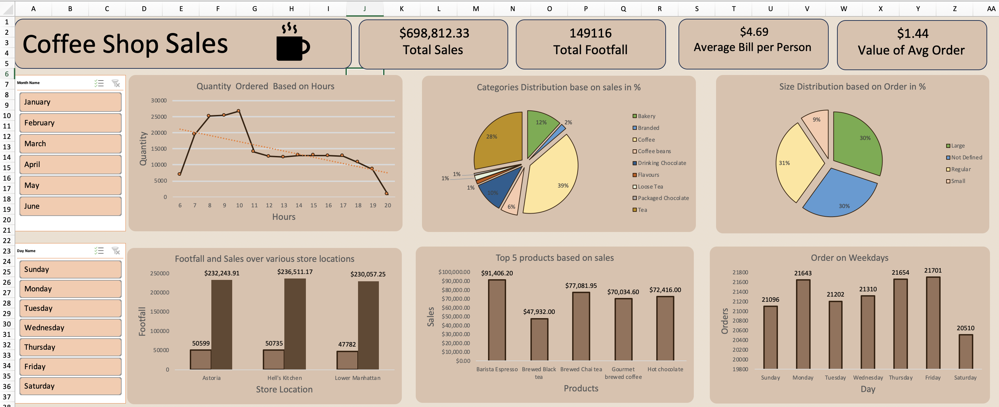

# Coffee Shop Sales Analysis
I analyzed coffee shop sales data using Microsoft Excel, applying techniques like pivot tables, various charts, and trend analysis. The project provides insights into sales performance and customer preferences. You can view the full analysis by downloading the [file](Coffee_Shop_Sales_Data_Analysis.xlxs).

<!-- Add banner here -->

<!-- Add buttons here -->

