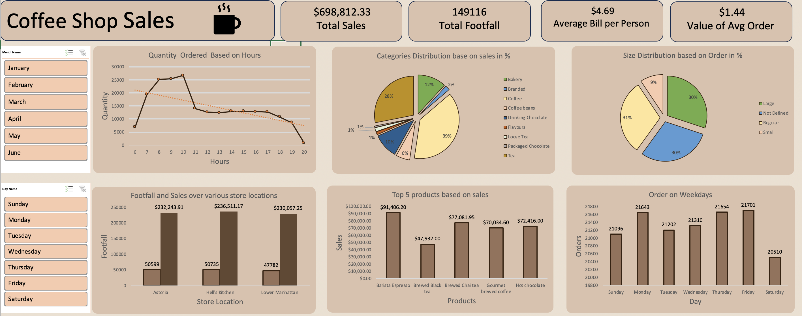
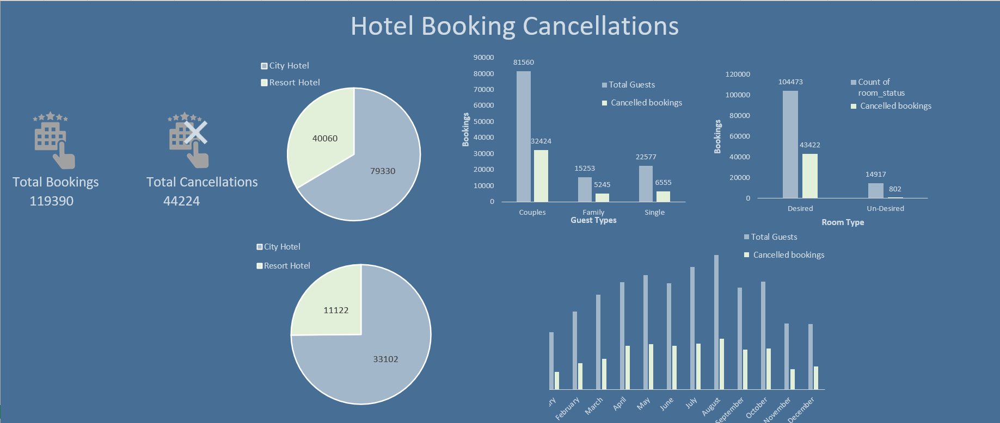
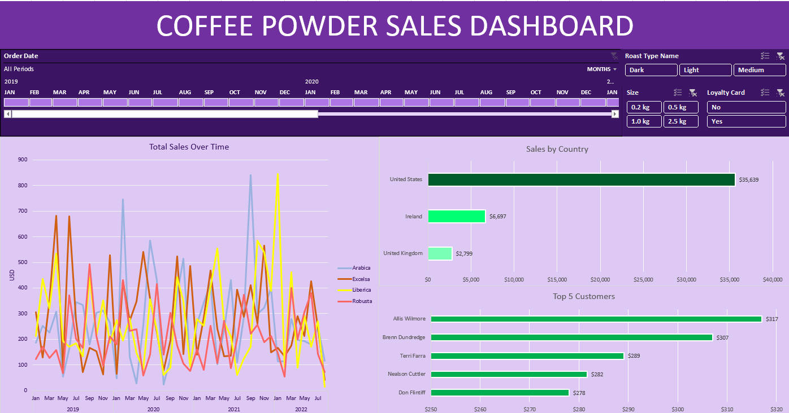

# Excel Analytics Dashboards
Welcome to my repository showcasing Analytics Dashboards created using Excel, designed to visualize key data insights and drive informed decision-making.

## Coffee Shop Sales Analysis
I analyzed coffee shop sales data using Microsoft Excel, applying techniques like pivot tables, various charts, and trend analysis. The project provides insights into sales performance and customer preferences. You can view the full analysis by downloading the [file](Coffee_Shop_Sales_Data_Analysis.xlxs).

<!-- Add banner here -->

## Hotel Booking Cancellation
In this project, I analyzed hotel cancellations data to uncover trends and insights. I employed techniques such as pivot tables, data visualization, and analysis to explore factors influencing cancellations. The resulting dashboard provides a clear overview of key metrics. You can view the full analysis and dashboard by downloading the [file](Hotel_Booking_Cancellations.xlsx).

<!-- Add banner here -->

<!-- Add buttons here -->

## Coffee Powder Sales Analysis
This project analyzes coffee powder sales data to reveal trends and insights driving purchasing behavior. Using pivot tables and data visualization, I explored key factors influencing sales performance. The resulting dashboard provides an overview of essential metrics for informed decision-making. Download the [file](coffeePowderOrdersProject.xlsx) to view the full analysis and dashboard.

